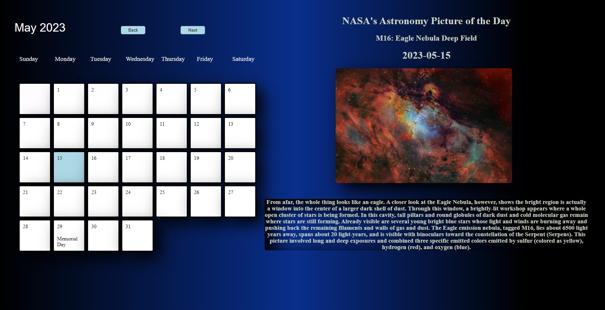

## Project 1: Day to Day Calendar

1. [ Description. ](#desc)
2. [ Web Address. ](#webadd)
3. [ Repository Address. ](#repoadd)

## 1. Description

### This is a calendar using HTML, CSS, and Javascript dynamic/non dynamic elements.

The calendar displays US national holidays as well as NASA's Astronomy picture of the day with a short description of the photo underneath, these change daily according to NASA's website. The calendar is fully interactive, you can add as well as save events on certian days, and upon refreshing the page your event will still be saved.

## 2. Web Address

file:///C:/Users/Yato/Documents/bootcamp/DayToDay-Calendar-main/index.html

## Repository Address

https://github.com/JuanSanchez39/DayToDay-Calendar
